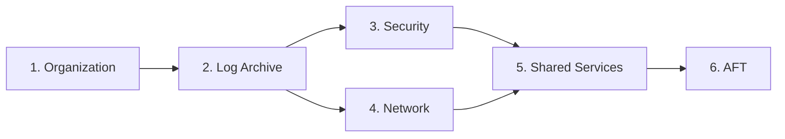

# Deployment Runbook

This runbook describes how to deploy and update the AWS Landing Zone infrastructure.

## Prerequisites

- [ ] Terraform >= 1.5.0 installed
- [ ] AWS CLI v2 configured
- [ ] Access to Management account
- [ ] Backend S3 bucket and DynamoDB table exist

## Deployment Order

:::caution Important
Modules must be deployed in the correct order due to dependencies.
:::



| Order | Module | Account | Dependencies |
|-------|--------|---------|--------------|
| 1 | Organization | Management | None |
| 2 | Log Archive | Log Archive | Organization |
| 3 | Security | Security | Log Archive |
| 4 | Network | Network Hub | Log Archive |
| 5 | Shared Services | Shared Services | Security, Network |
| 6 | AFT | AFT | All above |

## Initial Deployment

### Step 1: Configure Backend

Create the Terraform backend resources (run once):

```bash
# Create S3 bucket for state
aws s3api create-bucket \
  --bucket acme-terraform-state \
  --region us-east-1

# Enable versioning
aws s3api put-bucket-versioning \
  --bucket acme-terraform-state \
  --versioning-configuration Status=Enabled

# Create DynamoDB table for locking
aws dynamodb create-table \
  --table-name terraform-locks \
  --attribute-definitions AttributeName=LockID,AttributeType=S \
  --key-schema AttributeName=LockID,KeyType=HASH \
  --billing-mode PAY_PER_REQUEST
```

### Step 2: Deploy Organization Module

```bash
cd terraform/organization

# Copy example variables
cp terraform.tfvars.example terraform.tfvars

# Edit variables
vim terraform.tfvars

# Initialize and plan
terraform init
terraform plan -out=tfplan

# Review plan carefully!
# Apply
terraform apply tfplan
```

### Step 3: Deploy Log Archive Module

```bash
cd ../log-archive

# Assume role in Log Archive account
export AWS_PROFILE=log-archive

cp terraform.tfvars.example terraform.tfvars
vim terraform.tfvars

terraform init
terraform plan -out=tfplan
terraform apply tfplan
```

### Step 4: Deploy Security Module

```bash
cd ../security

export AWS_PROFILE=security

cp terraform.tfvars.example terraform.tfvars
vim terraform.tfvars

terraform init
terraform plan -out=tfplan
terraform apply tfplan
```

### Step 5: Deploy Network Module

```bash
cd ../network

export AWS_PROFILE=network

cp terraform.tfvars.example terraform.tfvars
vim terraform.tfvars

terraform init
terraform plan -out=tfplan
terraform apply tfplan
```

### Step 6: Deploy Shared Services Module

```bash
cd ../shared-services

export AWS_PROFILE=shared-services

cp terraform.tfvars.example terraform.tfvars
vim terraform.tfvars

terraform init
terraform plan -out=tfplan
terraform apply tfplan
```

### Step 7: Deploy AFT (Optional)

```bash
cd ../aft/aft-setup

export AWS_PROFILE=aft

terraform init
terraform plan -out=tfplan
terraform apply tfplan
```

## State Management

### The Bootstrap Problem

When deploying a Landing Zone, you face a chicken-and-egg problem:
- Terraform state should be stored in S3 with DynamoDB locking
- But the S3 bucket and DynamoDB table don't exist yet
- You need Terraform to create them, but Terraform needs state storage

### Solution: Two-Phase Deployment

#### Phase 1: Local State Bootstrap

Start with local state to create the state infrastructure:

```hcl
# terraform/organization/backend.tf (initial)
terraform {
  # Start with local backend
  backend "local" {
    path = "terraform.tfstate"
  }
}
```

Create state infrastructure:
```bash
cd terraform/organization
terraform init
terraform apply -target=aws_s3_bucket.terraform_state
terraform apply -target=aws_dynamodb_table.terraform_locks
```

#### Phase 2: Migrate to S3 Backend

Update backend configuration:
```hcl
# terraform/organization/backend.tf (final)
terraform {
  backend "s3" {
    bucket         = "acme-terraform-state"
    key            = "organization/terraform.tfstate"
    region         = "us-east-1"
    encrypt        = true
    dynamodb_table = "terraform-locks"
  }
}
```

Migrate state:
```bash
terraform init -migrate-state
```

Terraform will prompt:
```
Do you want to copy existing state to the new backend?
  Enter "yes" to copy and "no" to start with an empty state.
```

Enter `yes` to migrate.

### State File Per Account

Each account module has its own state file:

| Module | State Key |
|--------|-----------|
| organization | `organization/terraform.tfstate` |
| log-archive | `log-archive/terraform.tfstate` |
| security | `security/terraform.tfstate` |
| network | `network/terraform.tfstate` |
| shared-services | `shared-services/terraform.tfstate` |
| aft | `aft/terraform.tfstate` |

### State Locking

DynamoDB provides state locking to prevent concurrent modifications:

```hcl
resource "aws_dynamodb_table" "terraform_locks" {
  name         = "terraform-locks"
  billing_mode = "PAY_PER_REQUEST"
  hash_key     = "LockID"

  attribute {
    name = "LockID"
    type = "S"
  }
}
```

If you encounter a lock error:
```bash
# Check who holds the lock
aws dynamodb get-item \
  --table-name terraform-locks \
  --key '{"LockID": {"S": "acme-terraform-state/organization/terraform.tfstate"}}'

# Force unlock (use with caution!)
terraform force-unlock <LOCK_ID>
```

### State Backup and Recovery

S3 versioning is enabled for state recovery:

```bash
# List state versions
aws s3api list-object-versions \
  --bucket acme-terraform-state \
  --prefix organization/terraform.tfstate

# Restore previous version
aws s3api get-object \
  --bucket acme-terraform-state \
  --key organization/terraform.tfstate \
  --version-id <VERSION_ID> \
  terraform.tfstate.backup
```

### Cross-Account State Access

For modules deployed in different accounts, use assume role:

```hcl
terraform {
  backend "s3" {
    bucket         = "acme-terraform-state"
    key            = "security/terraform.tfstate"
    region         = "us-east-1"
    encrypt        = true
    dynamodb_table = "terraform-locks"
    
    # Assume role in management account where state bucket lives
    role_arn       = "arn:aws:iam::MANAGEMENT_ACCOUNT:role/TerraformStateAccess"
  }
}
```

### Importing Existing Resources

If resources already exist (e.g., from console or another tool):

```bash
# Import existing resource
terraform import aws_organizations_organization.main o-abc123

# Import with specific provider
terraform import -provider=aws.security aws_guardduty_detector.main abc123def456
```

### State Manipulation Commands

```bash
# List resources in state
terraform state list

# Show specific resource
terraform state show aws_s3_bucket.cloudtrail

# Move resource (rename)
terraform state mv aws_s3_bucket.old aws_s3_bucket.new

# Remove resource from state (doesn't delete actual resource)
terraform state rm aws_s3_bucket.orphaned

# Pull remote state locally
terraform state pull > terraform.tfstate.backup
```

:::caution
State manipulation commands can cause drift or orphaned resources. Always backup state before manipulation.
:::

## Day-to-Day Updates

### Making Changes

1. Create a branch:

```bash
git checkout -b feature/update-scp-policies
```

2. Make changes to Terraform files

3. Validate changes:

```bash
cd terraform/<module>
terraform init
terraform validate
terraform fmt -check
```

4. Plan changes:

```bash
terraform plan -out=tfplan
```

5. Create PR for review

6. After approval, apply:

```bash
terraform apply tfplan
```

### Using the Validation Script

```bash
# Validate all modules
./scripts/tf-validate.sh

# Validate specific module
./scripts/tf-validate.sh organization
```

### Using the Plan Script

```bash
# Plan specific account
./scripts/tf-plan.sh organization
./scripts/tf-plan.sh security
```

## CI/CD Integration

### GitHub Actions (when enabled)

```yaml
# .github/workflows/terraform.yml
name: Terraform

on:
  pull_request:
    paths:
      - 'terraform/**'

jobs:
  validate:
    runs-on: ubuntu-latest
    steps:
      - uses: actions/checkout@v4
      - uses: hashicorp/setup-terraform@v3
      - run: |
          for dir in terraform/*/; do
            echo "Validating $dir"
            terraform -chdir="$dir" init -backend=false
            terraform -chdir="$dir" validate
          done
```

## Rollback Procedures

### Minor Changes

Use Terraform to revert:

```bash
git revert <commit>
terraform plan -out=tfplan
terraform apply tfplan
```

### Major Changes

1. Identify the last known good state
2. Check Terraform state history in S3 versioning
3. Restore previous state version if needed:

```bash
# List state versions
aws s3api list-object-versions \
  --bucket acme-terraform-state \
  --prefix terraform/organization/terraform.tfstate

# Restore previous version
aws s3api get-object \
  --bucket acme-terraform-state \
  --key terraform/organization/terraform.tfstate \
  --version-id <version-id> \
  terraform.tfstate.backup
```

### Emergency Rollback

If infrastructure is broken:

1. Stop all deployments
2. Notify stakeholders
3. Identify breaking change
4. Apply targeted fix or full revert
5. Document incident

## Verification

After deployment, verify:

```bash
# Check Organization
aws organizations describe-organization

# Check SCPs
aws organizations list-policies --filter SERVICE_CONTROL_POLICY

# Check GuardDuty
aws guardduty list-detectors

# Check Security Hub
aws securityhub describe-hub

# Check Transit Gateway
aws ec2 describe-transit-gateways
```

## Related

- [Troubleshooting Runbook](./troubleshooting)
- [Account Vending Runbook](./account-vending)
- [Architecture Overview](../architecture/overview)
