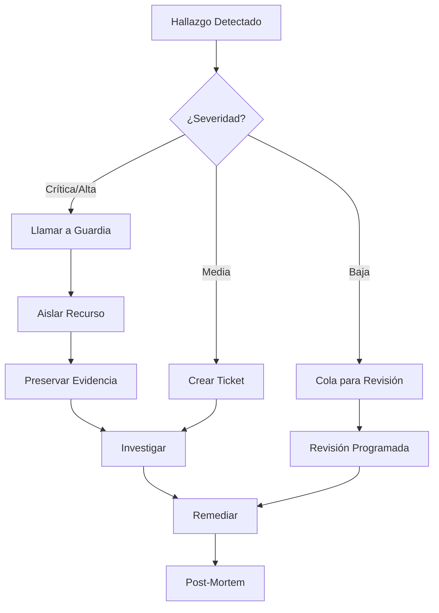

# Guía Operativa de Solución de Problemas {#troubleshooting-runbook}

Esta guía operativa proporciona orientación para los problemas comunes en la AWS Landing Zone.

## Referencia Rápida {#quick-reference}

| Síntoma | Causa Probable | Ir a |
|---------|--------------|---------|
| No se pueden crear recursos | Bloqueo por SCP | [Problemas de SCP](#scp-issues) |
| Hallazgo de GuardDuty | Incidente de seguridad | [Alertas de Seguridad](#security-alerts) |
| Acceso entre cuentas denegado | Problema de IAM/SCP | [Problemas de Acceso](#access-issues) |
| Conectividad de red | Ruteo/TGW | [Problemas de Red](#network-issues) |
| Estado de Terraform bloqueado | Bloqueo antiguo (stale) | [Problemas de Terraform](#terraform-issues) |

## Problemas de SCP {#scp-issues}

### Síntoma: "Access Denied" al crear recursos {#symptom-access-denied-when-creating-resources}

**Diagnóstico:**

1. Verifique qué SCP está bloqueando:

```bash
# Obtener las políticas efectivas para la cuenta
aws organizations list-policies-for-target \
  --target-id <account-id> \
  --filter SERVICE_CONTROL_POLICY
```

2. Pruebe la acción específica con el simulador de políticas de IAM:

```bash
aws iam simulate-principal-policy \
  --policy-source-arn arn:aws:iam::<account-id>:role/MyRole \
  --action-names ec2:RunInstances \
  --resource-arns arn:aws:ec2:us-east-1:<account-id>:instance/*
```

**SCPs comunes que bloquean:**

| SCP | Bloquea | Solución |
|-----|--------|----------|
| `restrict-regions` | Regiones no aprobadas | Utilice una región aprobada |
| `require-imdsv2` | EC2 sin IMDSv2 | Establezca `http_tokens = "required"` |
| `deny-root-user` | Acciones del usuario raíz | Utilice un usuario/rol de IAM |

**Resolución:**

1. Si existe una necesidad legítima, solicite una excepción de SCP.
2. Modifique el recurso para cumplir con la SCP.
3. Mueva la cuenta a una OU diferente (si es apropiado).

## Alertas de Seguridad {#security-alerts}

### Hallazgo de GuardDuty: Severidad Alta {#guardduty-finding-high-severity}

**Acciones Inmediatas:**

1. Verifique los detalles del hallazgo:

```bash
aws guardduty get-findings \
  --detector-id <detector-id> \
  --finding-ids <finding-id>
```

2. Para credenciales comprometidas:
   - Deshabilite el usuario/rol de IAM afectado.
   - Rote las credenciales.
   - Revise CloudTrail en busca de acciones no autorizadas.

3. Para una instancia EC2 comprometida:
   - Aísle la instancia (modifique el grupo de seguridad).
   - Cree una instantánea (snapshot) de EBS para análisis forense.
   - NO la termine inmediatamente.

**Escalamiento:**

| Severidad | Tiempo de Respuesta | Notificar |
|----------|---------------|--------|
| Crítica | 15 minutos | Equipo de seguridad + Gestión |
| Alta | 1 hora | Equipo de seguridad |
| Media | 24 horas | Equipo de seguridad |
| Baja | Revisión semanal | Solo registro (log) |

### Hallazgo de Security Hub: Control Fallido {#security-hub-finding-failed-control}

**Diagnóstico:**

```bash
aws securityhub get-findings \
  --filters '{"ComplianceStatus":[{"Value":"FAILED","Comparison":"EQUALS"}]}'
```

**Hallazgos Comunes:**

| Hallazgo | Solución |
|---------|-----|
| Bucket S3 público | Habilitar el bloqueo de acceso público |
| EBS no cifrado | Habilitar el cifrado por defecto |
| MFA de raíz deshabilitado | Habilitar MFA en el usuario raíz |
| CloudTrail deshabilitado | Verificar el trail de la organización |

## Problemas de Acceso {#access-issues}

### No se puede acceder a la cuenta a través de SSO {#cant-access-account-via-sso}

**Diagnóstico:**

1. Verifique la asignación de SSO:

```bash
aws sso-admin list-account-assignments \
  --instance-arn <sso-instance-arn> \
  --account-id <account-id> \
  --permission-set-arn <permission-set-arn>
```

2. Verifique el conjunto de permisos (permission set):

```bash
aws sso-admin describe-permission-set \
  --instance-arn <sso-instance-arn> \
  --permission-set-arn <permission-set-arn>
```

**Resolución:**

1. Asigne el usuario/grupo a la cuenta.
2. Verifique las políticas del conjunto de permisos.
3. Compruebe si la cuenta está suspendida.

### Fallo al Asumir Rol entre Cuentas {#cross-account-role-assumption-failed}

**Diagnóstico:**

```bash
# Verificar política de confianza
aws iam get-role --role-name CrossAccountRole

# Probar asunción
aws sts assume-role \
  --role-arn arn:aws:iam::<target-account>:role/CrossAccountRole \
  --role-session-name test
```

**Problemas Comunes:**

| Error | Causa | Solución |
|-------|-------|-----|
| `AccessDenied` | Política de confianza | Actualizar relación de confianza |
| `MalformedPolicyDocument` | Principal inválido | Corregir formato del ARN |
| `InvalidIdentityToken` | Endpoint regional de STS | Utilizar endpoint global |

## Problemas de Red {#network-issues}

### No se puede conectar a los recursos a través de Transit Gateway {#cant-connect-to-resources-via-transit-gateway}

**Diagnóstico:**

1. Verifique el adjunto (attachment) de TGW:

```bash
aws ec2 describe-transit-gateway-vpc-attachments \
  --filters "Name=vpc-id,Values=<vpc-id>"
```

2. Verifique la tabla de ruteo de TGW:

```bash
aws ec2 search-transit-gateway-routes \
  --transit-gateway-route-table-id <rt-id> \
  --filters "Name=type,Values=static,propagated"
```

3. Verifique la tabla de ruteo de la VPC:

```bash
aws ec2 describe-route-tables \
  --filters "Name=vpc-id,Values=<vpc-id>"
```

**Problemas Comunes:**

| Problema | Síntomas | Solución |
|-------|----------|-----|
| Ruta faltante | Los paquetes no salen de la VPC | Añadir ruta hacia el TGW |
| Tabla de ruteo errónea | Ruteo asimétrico | Corregir asociación de RT del TGW |
| Grupo de seguridad | Tiempo de espera agotado | Permitir tráfico en el SG |
| NACL | Conexión rechazada | Verificar reglas de NACL |

### Fallo en la Resolución de DNS {#dns-resolution-failing}

**Diagnóstico:**

```bash
# Verificar reglas del Resolver de Route53
aws route53resolver list-resolver-rules

# Verificar ajustes de DNS de la VPC
aws ec2 describe-vpc-attribute \
  --vpc-id <vpc-id> \
  --attribute enableDnsSupport
```

**Resolución:**

1. Verifique la asociación de la zona alojada privada (PHZ).
2. Verifique la compartición de reglas del resolver (RAM).
3. Verifique `enableDnsSupport` y `enableDnsHostnames`.

## Problemas de Terraform {#terraform-issues}

### Bloqueo del Estado no Liberado {#state-lock-not-released}

**Síntoma:** "Error acquiring the state lock"

**Resolución:**

1. Verifique que no haya otro proceso ejecutándose:

```bash
# Verificar quién tiene el bloqueo
aws dynamodb get-item \
  --table-name terraform-locks \
  --key '{"LockID":{"S":"<state-path>"}}'
```

2. Si es un bloqueo antiguo, fuerce el desbloqueo:

```bash
terraform force-unlock <lock-id>
```

:::warning
¡Solo fuerce el desbloqueo si está seguro de que no hay otro proceso ejecutándose!
:::

### Desviación del Estado Detectada (Drift) {#state-drift-detected}

**Diagnóstico:**

```bash
terraform plan -refresh-only
```

**Resolución:**

1. Si la desviación es esperada, importe o actualice el estado:

```bash
# Importar recurso existente
terraform import aws_instance.example i-1234567890abcdef0

# O refrescar el estado
terraform apply -refresh-only
```

2. Si la desviación es inesperada, investigue quién cambió el recurso.

## Remediación de Seguridad {#security-remediation}

### Remediación de Hallazgos de GuardDuty {#guardduty-finding-remediation}

#### Niveles de Severidad {#severity-levels}
| Severidad | Rango | Tiempo de Respuesta | Acción |
|----------|-------|---------------|--------|
| Crítica | 9.0-10.0 | Inmediata | Llamada al personal de guardia, aislar recurso |
| Alta | 7.0-8.9 | < 1 hora | Alertar al equipo de seguridad |
| Media | 4.0-6.9 | < 24 horas | Revisar y remediar |
| Baja | 1.0-3.9 | < 1 semana | Revisión programada |

#### Hallazgos Comunes y Remediación {#common-findings-and-remediation}

##### UnauthorizedAccess:EC2/SSHBruteForce {#unauthorizedaccess-ec2-sshbruteforce}
**Descripción**: Ataque de fuerza bruta SSH detectado.
**Remediación**:
1. Verifique si la instancia debe tener el puerto SSH expuesto.
2. Revise las reglas del Grupo de Seguridad.
3. Considere usar Session Manager en lugar de SSH.
4. Si está comprometida, aísle e investigue.

```bash
# Aislar instancia eliminando todos los grupos de seguridad
aws ec2 modify-instance-attribute \
  --instance-id i-1234567890abcdef0 \
  --groups sg-isolation-only
```

##### Recon:EC2/PortProbeUnprotectedPort {#recon-ec2-portprobeunprotectedport}
**Descripción**: Sondeo de un puerto desprotegido.
**Remediación**:
1. Revise el Grupo de Seguridad en busca de puertos abiertos innecesarios.
2. Cierre los puertos que no sean requeridos por la aplicación.
3. Considere usar AWS WAF para aplicaciones web.

##### CryptoCurrency:EC2/BitcoinTool.B {#cryptocurrency-ec2-bitcointool-b}
**Descripción**: Instancia EC2 comunicándose con la red Bitcoin.
**Remediación**:
1. **Inmediata**: Aislar la instancia.
2. Capturar volcado de memoria si es posible.
3. Crear AMI para análisis forense.
4. Terminar la instancia.
5. Investigar cómo se comprometió la instancia.
6. Revisar las credenciales de IAM usadas para lanzar la instancia.

##### Trojan:EC2/DNSDataExfiltration {#trojan-ec2-dnsdataexfiltration}
**Descripción**: Exfiltración de datos a través de consultas DNS.
**Remediación**:
1. Aislar la instancia inmediatamente.
2. Bloquear el tráfico DNS a nivel de VPC.
3. Investigar los logs de consultas DNS.
4. Verificar si hay credenciales comprometidas.

### Remediación de Hallazgos de Security Hub {#security-hub-finding-remediation}

#### Controles Comunes de Security Hub {#common-security-hub-controls}

##### [S3.1] S3 Block Public Access should be enabled {#s3-1-s3-block-public-access-should-be-enabled}
```bash
# Remediar: Habilitar el bloqueo de acceso público
aws s3api put-public-access-block \
  --bucket my-bucket \
  --public-access-block-configuration \
  "BlockPublicAcls=true,IgnorePublicAcls=true,BlockPublicPolicy=true,RestrictPublicBuckets=true"
```

##### [EC2.19] Security groups should not allow unrestricted access to high risk ports {#ec2-19-security-groups-should-not-allow-unrestricted-access-to-high-risk-ports}
```bash
# Buscar y eliminar reglas infractoras
aws ec2 describe-security-groups \
  --filters "Name=ip-permission.from-port,Values=22" \
            "Name=ip-permission.cidr,Values=0.0.0.0/0"

# Revocar la regla
aws ec2 revoke-security-group-ingress \
  --group-id sg-12345678 \
  --protocol tcp \
  --port 22 \
  --cidr 0.0.0.0/0
```

##### [IAM.1] IAM policies should not allow full "*" administrative privileges {#iam-1-iam-policies-should-not-allow-full-administrative-privileges}
```bash
# Buscar políticas con acceso de administrador
aws iam list-policies --scope Local --query \
  'Policies[?contains(PolicyName, `Admin`)]'

# Revisar y restringir la política
aws iam get-policy-version \
  --policy-arn arn:aws:iam::123456789012:policy/MyPolicy \
  --version-id v1
```

### Flujo de Trabajo de Respuesta ante Incidentes {#incident-response-workflow-1}



### Procedimientos de Escalamiento {#escalation-procedures}

| Nivel | Activador | Contacto | Respuesta |
|-------|---------|---------|----------|
| L1 | Hallazgo medio | Slack del equipo de seguridad | Acuse en 4 horas |
| L2 | Hallazgo alto | Equipo de seguridad + gerente | Acuse en 1 hora |
| L3 | Hallazgo crítico | Seguridad + Ejecutivos + Legal | Respuesta inmediata |
| L4 | Brecha confirmada | CISO + Legal + PR | Comandante de incidentes asignado |

### Preservación de Evidencia {#evidence-preservation}

Antes de remediar, preserve la evidencia:

```bash
# 1. Crear instantánea de los volúmenes EBS
aws ec2 create-snapshot \
  --volume-id vol-1234567890abcdef0 \
  --description "Forensics - Incident INC-001"

# 2. Crear AMI de la instancia
aws ec2 create-image \
  --instance-id i-1234567890abcdef0 \
  --name "Forensics-INC-001" \
  --no-reboot

# 3. Exportar logs de CloudTrail
aws s3 cp s3://cloudtrail-bucket/AWSLogs/ ./forensics/ --recursive \
  --exclude "*" \
  --include "*2024-01-15*"

# 4. Exportar VPC Flow Logs
aws logs filter-log-events \
  --log-group-name vpc-flow-logs \
  --start-time 1705276800000 \
  --end-time 1705363200000 \
  > flow-logs-incident.json
```

### Acciones Post-Incidente {#post-incident-actions}

1. **Documentar**: Crear informe de incidente con cronología.
2. **Revisar**: Identificar brechas en detección/prevención.
3. **Mejorar**: Actualizar guías operativas y automatización.
4. **Capacitar**: Compartir aprendizajes con el equipo.
5. **Probar**: Validar la efectividad de la remediación.

## Ubicación de Logs {#log-locations}

| Tipo de Log | Ubicación |
|----------|----------|
| CloudTrail | s3://acme-log-archive-cloudtrail/ |
| VPC Flow Logs | s3://acme-log-archive-vpc-flow-logs/ |
| Config | s3://acme-log-archive-config/ |
| GuardDuty | s3://acme-security-guardduty-findings/ |
| ALB Access Logs | s3://acme-log-archive-alb-logs/ |

## Contactos de Escalamiento {#escalation-contacts}

| Tipo de Problema | Primario | Secundario |
|------------|---------|-----------|
| Incidente de Seguridad | security-team@acme.com | CISO |
| Infraestructura | platform-team@acme.com | Arquitecto Cloud |
| Problemas de Acceso | it-helpdesk@acme.com | Equipo de Plataforma |

## Relacionado {#related}

- [Modelo de Seguridad](../architecture/security-model)
- [Diseño de Red](../architecture/network-design)
- [Guía Operativa de Despliegue](./deployment)
